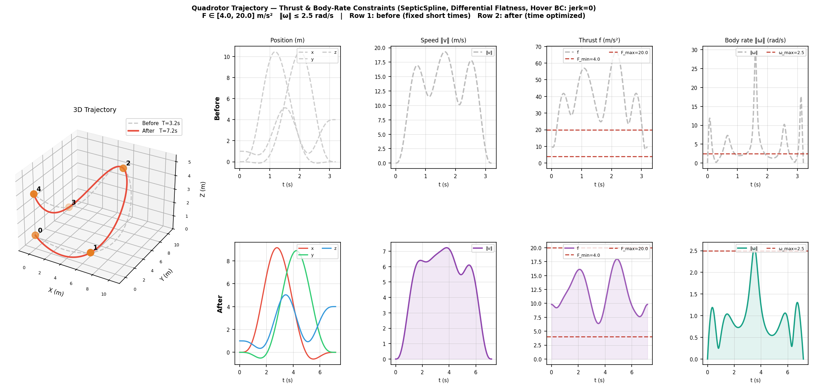

# spline-trajectory

Python bindings for [SplineTrajectory](README_cpp.md) — a fast C++ library for smooth N-dimensional trajectory optimization based on MINCO-family splines (Cubic / Quintic / Septic).

**[Python Docs]** | [C++ Library](README_cpp.md) | [中文](README_zh.md)

## Installation

```bash
pip install spline-trajectory                    # basic (numpy only)
pip install "spline-trajectory[optimize]"        # with scipy for optimize()
```

Requires Python ≥ 3.9. Pre-built wheels are provided for Linux, macOS, and Windows (x86-64 and arm64).

---

## Spline types

| Class | Order | Minimizes | MINCO equiv |
|---|---|---|---|
| `CubicSplineND` | 3 | Acceleration | S2 |
| `QuinticSplineND` | 5 | Jerk | S3 |
| `SepticSplineND` | 7 | Snap | S4 |

All three families are available for spatial dimensions 1–6.  
Default aliases (`CubicSpline`, `QuinticSpline`, `SepticSpline`) point to the 3D variants.

---

## Quick Start

```python
import numpy as np
from spline_trajectory import CubicSpline3D, BoundaryConditions3D, Deriv

waypoints = np.array([[0, 0, 0],
                      [1, 0, 0],
                      [2, 1, 0]], dtype=float)

bc = BoundaryConditions3D(
    start_velocity=[0.5, 0, 0],
    end_velocity=[0, -0.5, 0],
)

spline = CubicSpline3D([0.0, 1.0, 2.0], waypoints, bc)

print(spline.evaluate(1.0, Deriv.Pos))   # position at t=1  → shape (3,)
print(spline.evaluate(1.0, Deriv.Vel))   # velocity at t=1

# Batch evaluation → shape (N, 3)
ts = np.linspace(0, 2, 200)
positions = spline.evaluate_batch(ts.tolist(), Deriv.Pos)
```

---

## Trajectory Optimization

### 1. Optimize time segments, fix all waypoints

The simplest use case: waypoints are hard constraints, only the duration of each
segment is optimized to minimize total time + jerk energy.

```python
import numpy as np
from spline_trajectory import (
    QuinticOptimizer3D, BoundaryConditions3D,
    OptimizationMask, Deriv, optimize,
)

waypoints = np.array([[0, 0, 0],
                      [2, 1, 1],
                      [4, 0, 2],
                      [6, 2, 0]], dtype=float)
n_seg = len(waypoints) - 1

# Fix all waypoints, free all time segments
mask = OptimizationMask()
mask.waypoints = [0] * len(waypoints)   # 0 = fixed
mask.time      = [1] * n_seg            # 1 = optimize

opt = QuinticOptimizer3D()
opt.set_config(rho_energy=1.0)          # weight for jerk-energy regularization
ctx = opt.prepare_context(
    time_segments=[1.0] * n_seg,
    waypoints=waypoints,
    bc=BoundaryConditions3D(),
    mask=mask,
)

def time_cost(times):
    """Minimise total duration."""
    return float(np.sum(times)), np.ones_like(times)

result = optimize(opt, ctx, time_cost=time_cost, max_iter=300)
print(result.message)

spline = opt.get_working_spline(ctx)
print(f"Optimized duration: {spline.duration:.3f} s")
```

---

### 2. Optimize waypoints, fix time segments

Let the optimizer relocate intermediate waypoints while keeping durations fixed.
Useful when the rough path shape matters more than timing.

```python
import numpy as np
from spline_trajectory import (
    QuinticOptimizer3D, BoundaryConditions3D,
    OptimizationMask, optimize,
)

waypoints = np.array([[0, 0, 0],
                      [1, 1, 0],   # ← will be optimized
                      [3, 0, 0],   # ← will be optimized
                      [4, 0, 0]], dtype=float)
n_seg = len(waypoints) - 1

mask = OptimizationMask()
mask.waypoints = [0, 1, 1, 0]   # fix start/end, free middle points
mask.time      = [0] * n_seg    # fix all durations

opt = QuinticOptimizer3D()
opt.set_config(rho_energy=1.0)
ctx = opt.prepare_context(
    time_segments=[1.0] * n_seg,
    waypoints=waypoints,
    bc=BoundaryConditions3D(),
    mask=mask,
)

# Energy-only cost (no custom time/integral cost needed)
def zero_time(t): return 0.0, np.zeros_like(t)
def zero_integral(t, tg, seg, step, p, v, a, j, s):
    z = np.zeros_like(p); return 0.0, z, z, z, z, z, 0.0

result = optimize(opt, ctx, time_cost=zero_time, integral_cost=zero_integral)
spline = opt.get_working_spline(ctx)
```

---

### 3. Optimize both time segments and waypoints

Free everything — let the optimizer jointly tune timing and path shape.

```python
import numpy as np
from spline_trajectory import (
    QuinticOptimizer3D, BoundaryConditions3D,
    OptimizationMask, optimize,
)

waypoints = np.array([[0, 0, 0],
                      [1, 2, 0],
                      [3, 1, 1],
                      [5, 0, 0]], dtype=float)
n_seg = len(waypoints) - 1

mask = OptimizationMask()
mask.waypoints = [0, 1, 1, 0]   # fix only start/end positions
mask.time      = [1] * n_seg    # all durations free

opt = QuinticOptimizer3D()
opt.set_config(rho_energy=1.0)
ctx = opt.prepare_context(
    time_segments=[1.0] * n_seg,
    waypoints=waypoints,
    bc=BoundaryConditions3D(),
    mask=mask,
)

def time_cost(times):
    return float(np.sum(times)), np.ones_like(times)

result = optimize(opt, ctx, time_cost=time_cost)
spline = opt.get_working_spline(ctx)
print(f"Duration: {spline.duration:.3f} s,  Energy: {spline.energy:.4f}")
```

---

### 4. Custom integral cost (e.g. penalise high velocity)

`integral_cost` is called at every integration sample along the trajectory.  
It receives the local state `(p, v, a, j, s)` and must return the cost and
its gradients w.r.t. each quantity.

```python
import numpy as np
from spline_trajectory import QuinticOptimizer3D, BoundaryConditions3D, optimize

waypoints = np.array([[0, 0, 0], [2, 1, 0], [4, 0, 0]], dtype=float)

opt = QuinticOptimizer3D()
opt.set_config(rho_energy=0.5, integral_num_steps=64)
ctx = opt.prepare_context(
    time_segments=[1.0, 1.0],
    waypoints=waypoints,
    bc=BoundaryConditions3D(),
)

V_MAX = 2.0   # m/s — soft speed limit

def vel_penalty(t, t_global, seg, step, p, v, a, j, s):
    """Soft penalty for |v| > V_MAX."""
    excess = np.maximum(np.linalg.norm(v) - V_MAX, 0.0)
    cost = 0.5 * excess ** 2
    gv = excess * v / (np.linalg.norm(v) + 1e-9) if excess > 0 else np.zeros_like(v)
    z = np.zeros_like(p)
    return cost, z, gv, z, z, z, 0.0

def zero_time(t): return 0.0, np.zeros_like(t)

result = optimize(opt, ctx, time_cost=zero_time, integral_cost=vel_penalty)
spline = opt.get_working_spline(ctx)
```

---

### 5. Closed-loop trajectory (drone racing / periodic motion)

`optimize_closed_loop` closes the position loop and jointly optimizes the
boundary derivatives (velocity, acceleration) so that the trajectory is
C² continuous at the junction — the drone can lap indefinitely.

```python
import numpy as np
from spline_trajectory import QuinticOptimizer3D, optimize_closed_loop, Deriv

# Gates arranged roughly in a circle
gates = np.array([
    [7.0, 3.5, 1.5],
    [6.0, 7.0, 1.2],
    [2.0, 7.0, 0.8],
    [0.0, 4.5, 1.0],
    [2.5, 1.0, 1.8],
    [5.0, 1.0, 1.2],
], dtype=float)

time_segs = [1.2] * len(gates)   # one segment per gate (loop is closed automatically)

opt = QuinticOptimizer3D()
result, ctx = optimize_closed_loop(
    opt,
    waypoints=gates,
    time_segments=time_segs,
    closure_weight=5000.0,  # penalty weight for BC continuity at junction
    rho_energy=0.5,
    max_iter=500,
)
print(result.message)

spline = opt.get_working_spline(ctx)

# Verify continuity at the junction
t0, tf = spline.start_time, spline.end_time
dv = np.linalg.norm(spline.evaluate(tf, Deriv.Vel) - spline.evaluate(t0, Deriv.Vel))
da = np.linalg.norm(spline.evaluate(tf, Deriv.Acc) - spline.evaluate(t0, Deriv.Acc))
print(f"Duration: {spline.duration:.2f} s")
print(f"BC closure  ‖Δv‖ = {dv:.2e},  ‖Δa‖ = {da:.2e}")   # should be ~1e-4 or less

# Sample the full lap
ts = np.linspace(t0, tf, 500)
pos = spline.evaluate_batch(ts.tolist(), Deriv.Pos)   # shape (500, 3)
vel = spline.evaluate_batch(ts.tolist(), Deriv.Vel)
```

---

### 6. Soft constraints via `integral_cost`

Every call to `optimize()` or `optimize_closed_loop()` accepts an `integral_cost` function
that is evaluated at every integration sample.  Return a scalar penalty and its gradients
w.r.t. `(p, v, a, j, s)` and local time `t` to impose soft constraints.

#### General pattern

```python
def my_constraint(t, t_global, seg, step, p, v, a, j, s):
    # Compute penalty and gradients
    cost = ...
    gp = np.zeros_like(p)   # ∂cost/∂p
    gv = np.zeros_like(v)   # ∂cost/∂v
    ga = np.zeros_like(a)   # ∂cost/∂a
    gj = np.zeros_like(j)   # ∂cost/∂j
    gs = np.zeros_like(s)   # ∂cost/∂s
    gt = 0.0                 # ∂cost/∂t (non-zero only when optimising time)
    return cost, gp, gv, ga, gj, gs, gt
```

#### Quadrotor: thrust + body-rate constraints (`demo_quadrotor.py`)

Uses `SepticOptimizer3D` (7th-order, S4-MINCO) so that **jerk is a boundary-condition
variable**.  Setting `start_jerk = end_jerk = [0,0,0]` hard-constrains body rate to
zero at take-off and landing (hover condition).

Under the differential-flatness model (zero drag, yaw=0, mass=1 kg):

| Physical quantity | Expression |
|---|---|
| Thrust vector | `f_vec = a + g·ẑ` |
| Collective thrust | `f = ‖f_vec‖` |
| Body-axis unit vector | `z_b = f_vec / f` |
| Body-rate vector | `ω` — exact flatness map (Zhepei Wang, GCOPTER) |

The `integral_cost` function implements the exact forward/backward pass of the
flatness map so that gradients w.r.t. `(a, j)` are analytically correct.

**Comparison** — before (fixed 0.8 s/segment) vs. after (time optimized):



> Row 1 (grey dashed): trajectory executed in 3.2 s — 537/600 thrust violations,
> ω_max = 29.4 rad/s.  
> Row 2 (red solid): optimizer extends to 9.5 s — f ∈ [6.5, 14.2] m/s²,
> ω_max = 0.92 rad/s — all constraints satisfied.

See [`examples/python/demo_quadrotor.py`](examples/python/demo_quadrotor.py) for the full implementation including
the `FlatnessMap` forward/backward class.

#### Common constraint recipes

| Constraint | Cost term | Non-zero gradient |
|---|---|---|
| Speed limit `‖v‖ ≤ v_max` | `max(‖v‖−v_max, 0)²` | `gv` |
| Acceleration limit `‖a‖ ≤ a_max` | `max(‖a‖−a_max, 0)²` | `ga` |
| Collective thrust bounds | `max(F_MIN−f,0)² + max(f−F_MAX,0)²` | `ga` |
| Body-rate limit | `max(ω−ω_max, 0)²` | `ga`, `gj` |
| Spherical keep-out zone (centre `c`, radius `r`) | `max(r−‖p−c‖, 0)²` | `gp` |
| Min altitude `p_z ≥ h` | `max(h−p_z, 0)²` | `gp` |

> **Tip — penalty weight tuning:**  
> Start with a small weight (e.g. `10`) to let the optimizer find a feasible region first,
> then increase toward `100–1000` until the constraint is well-satisfied.
> Check `integral_num_steps` (default 64) — increase to 128 for stricter enforcement.

---

## API Reference

### Spline classes

All spline classes share the same interface.

```python
CubicSpline3D(time_points, waypoints, bc=BoundaryConditions3D())
QuinticSpline3D(time_points, waypoints, bc=BoundaryConditions3D())
SepticSpline3D(time_points, waypoints, bc=BoundaryConditions3D())
# also: *1D, *2D, *4D, *5D, *6D variants
```

| Parameter | Type | Description |
|---|---|---|
| `time_points` | `list[float]` | Absolute time at each waypoint, length N |
| `waypoints` | `ndarray (N, DIM)` | Waypoint positions |
| `bc` | `BoundaryConditionsND` | Boundary conditions (default: all zero) |

**Properties:** `start_time`, `end_time`, `duration`, `num_segments`, `energy`, `is_initialized`

**Methods:**

```python
spline.evaluate(t, deriv=Deriv.Pos)              # → ndarray (DIM,)
spline.evaluate_batch(times, deriv=Deriv.Pos)    # → ndarray (N, DIM)
```

`Deriv` values: `Pos`, `Vel`, `Acc`, `Jerk`, `Snap`, `Crackle`, `Pop`

---

### BoundaryConditions

```python
bc = BoundaryConditions3D()                             # all zero
bc = BoundaryConditions3D(start_velocity, end_velocity)
bc = BoundaryConditions3D(start_velocity, start_acceleration,
                          end_velocity,   end_acceleration)
bc = BoundaryConditions3D(start_velocity, start_acceleration, start_jerk,
                          end_velocity,   end_acceleration,   end_jerk)
```

All vector arguments accept list, tuple, or `ndarray` of shape `(DIM,)`.  
Properties: `start_velocity`, `start_acceleration`, `start_jerk`, `end_velocity`, `end_acceleration`, `end_jerk`

---

### Optimizers

```python
opt = QuinticOptimizer3D()           # also Cubic*, Septic*, *1D–*6D
opt.set_config(
    rho_energy=1.0,                  # weight for built-in energy regularization
    integral_num_steps=64,           # trapezoidal integration steps per segment
)
ctx = opt.prepare_context(
    time_segments,                   # list[float], length N_seg
    waypoints,                       # ndarray (N_seg+1, DIM)
    bc=BoundaryConditions3D(),
    mask=None,                       # OptimizationMask or None (optimize everything)
)
x0  = opt.generate_initial_guess(ctx)          # → ndarray (D,)
cost, grad = opt.evaluate(ctx, x, time_cost, integral_cost)
spline = opt.get_working_spline(ctx)           # → QuinticSpline3D (copy)
```

---

### OptimizationMask

Controls which variables are free vs. fixed.

```python
mask = OptimizationMask()
mask.time      = [1, 0, 1]   # per-segment: 1=optimize, 0=fix
mask.waypoints = [0, 1, 1, 0] # per-waypoint: 0=fix, 1=optimize
mask.start.v = True           # optimize start velocity BC
mask.start.a = True           # optimize start acceleration BC
mask.end.v   = True
mask.end.a   = True
```

---

### optimize()

```python
from spline_trajectory import optimize

result = optimize(
    optimizer, ctx,
    time_cost=None,       # callable(times) → (float, ndarray)  or None
    integral_cost=None,   # callable(t, t_global, seg, step, p,v,a,j,s)
                          #         → (cost, gp, gv, ga, gj, gs, gt)  or None
    max_iter=200,
    ftol=1e-9,
    gtol=1e-6,
)
# result is scipy.optimize.OptimizeResult
```

**time_cost signature:**
```python
def time_cost(times: np.ndarray) -> tuple[float, np.ndarray]:
    # times: shape (N_seg,) — decoded segment durations
    # returns: scalar cost, gradient of shape (N_seg,)
    return float(np.sum(times)), np.ones_like(times)
```

**integral_cost signature:**
```python
def integral_cost(t, t_global, seg, step, p, v, a, j, s):
    # t        : local time within segment
    # t_global : global time
    # seg      : segment index
    # step     : integration step index
    # p,v,a,j,s: ndarray (DIM,) — pos, vel, acc, jerk, snap
    # returns  : (cost, gp, gv, ga, gj, gs, gt)
    z = np.zeros_like(p)
    return 0.0, z, z, z, z, z, 0.0
```

---

### optimize_closed_loop()

```python
from spline_trajectory import optimize_closed_loop

result, ctx = optimize_closed_loop(
    optimizer,
    waypoints,            # ndarray (N, DIM) — last row is overwritten with first
    time_segments,        # list[float], length N (one per gate)
    closure_weight=5000.0,  # penalty weight for BC continuity at junction
    rho_energy=0.5,
    integral_num_steps=64,
    optimize_times=True,
    time_cost=None,
    integral_cost=None,
    max_iter=300,
)
spline = optimizer.get_working_spline(ctx)
```

The function:
1. Closes the position loop (`waypoints[-1] ← waypoints[0]`)
2. Frees start/end boundary derivatives as decision variables
3. Adds `closure_weight * ‖start_BC − end_BC‖²` to the objective

A `closure_weight` of 1000–10000 typically achieves `‖Δv‖ < 1e-4`.

---

## Supported dimensions

| Suffix | DIM |
|--------|-----|
| `1D` | 1 |
| `2D` | 2 |
| `3D` | 3 (default alias) |
| `4D` | 4 |
| `5D` | 5 |
| `6D` | 6 (e.g. 6-DOF robot joints) |

```python
from spline_trajectory import (
    QuinticSpline6D, BoundaryConditions6D,
    QuinticOptimizer6D,
)
```

---

## C++ Library

For the header-only C++ library, performance benchmarks, and the `SplineOptimizer` C++ API, see [README_cpp.md](README_cpp.md).

## License

MIT License. See [LICENSE](LICENSE) for details.
